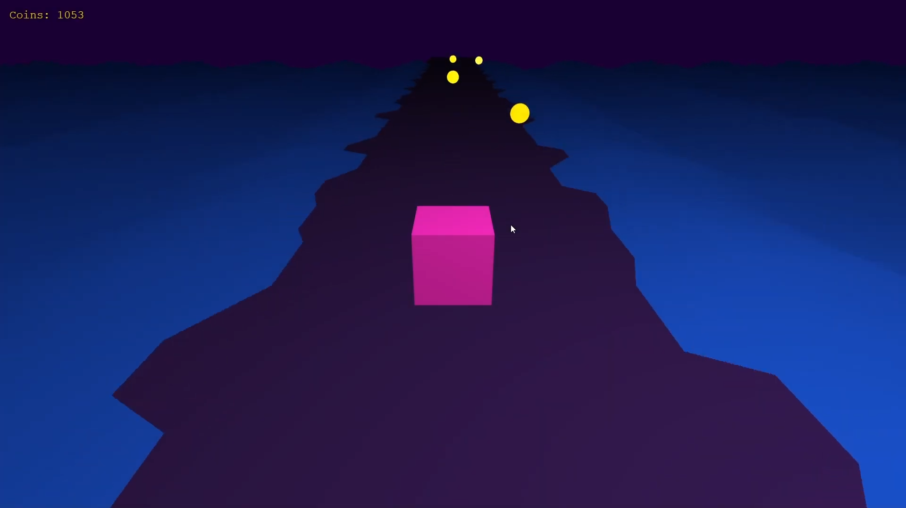

# Geometry Run
A 3D version of the game "Geometry Dash". You control a cube that can move in three lanes and jump to avoid obstacles that are generated on the track. Both the map and the player are customizable by buying cosmetics in the shop with in-game collectable coins.

**[Click here to play the game on your browser!](https://guihvc.github.io/Geometry-Run/)**

## Demonstration *(Trailer?!)*

Click the image to open video on youtube:

## Status

This was a college project for a Computer Graphics discipline and is marked as finished.

## Authors

Guilherme Henrique Vasconcelos da Cunha

Vinicius Yuiti Okuma Shimizu

Mohamad Walid Marrer Abed
